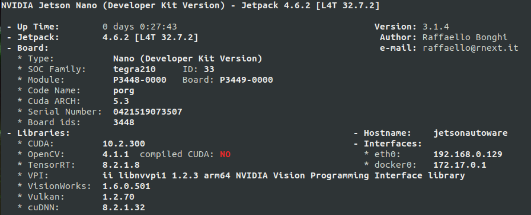

# installDonkeycarJetsonNanoJP461
Automates (partly) the installation described at [donkeycar.com](https://docs.donkeycar.com/guide/robot_sbc/setup_jetson_nano/) for a Jetson Nano JP 4.6.

*128GB, jetsonautoware46n6


## Prerequisites

Prepare SD-card with the latest Nvidia JetPack version (JP 4.6) for Jetson Nano following [donkeycar.com](https://docs.donkeycar.com/guide/robot_sbc/setup_jetson_nano/), do your first time boot and clone the repo.
```
git clone https://github.com/connected-autonomous-mobility/installDonkeycarJetsonNanoJP46.git
cd installDonkeycarJetsonNanoJP46
```
Update software indicated on Ubuntu Software Center & reboot.

## 1 Preparation

Log the installation for debugging purposes. (thx to @Naisy for this great tip :-)
```
script install_part1.log
```

Execute installation script part 1
```
./install_part1.sh
```
hint: part 1 requires one input from you right near the beginning to confirm restart of the docker aservice after uptdating.

## 2 Reboot
```
sudo reboot
```

## 3 Installation
Log the installation for debugging purposes.
```
script install_part2.log
```
Execute installation script part 2
```
./install_part2.sh
```
Terminate logging
```
exit
````
